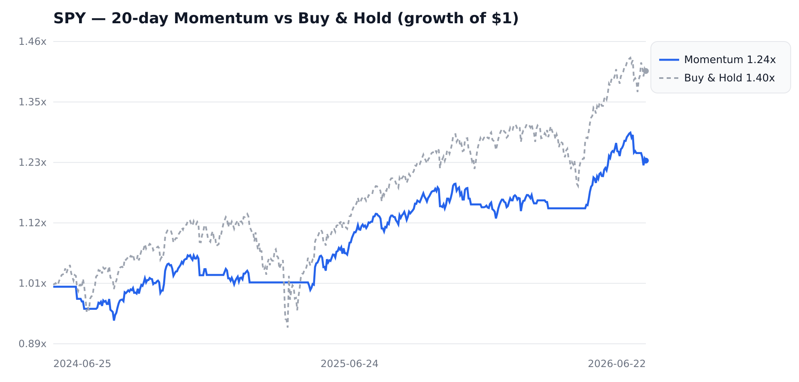

# SPY 20-day Momentum Backtest (Rust)

A small, self-contained quant pipeline: real daily SPY data → a 20-day momentum
long/flat strategy backtested in Rust → a **shareable equity-curve report**
(live web page + PNG/SVG chart).

## 📊 Shareable artifact

**Live report (GitHub Pages):** **https://peterzerg.github.io/spy-momentum-backtest/**

**Repo:** https://github.com/PeterZerg/spy-momentum-backtest

The live page embeds the equity-curve chart and the metrics table and is fully
self-contained (no external assets). The same chart is also committed as a
standalone image:

- `report/equity.png` — raster chart (1920×920), drops into chat/email/slides.
- `report/equity.svg` — vector chart.
- `report/index.html` — the report page (open locally in any browser, or view
  the hosted copy at the URL above).



## 1. Data source path used

**Path taken: real market data (network was available).**

- **Source:** Yahoo Finance chart API
  (`https://query2.finance.yahoo.com/v8/finance/chart/SPY?range=2y&interval=1d`),
  **daily adjusted close** for **SPY** (SPDR S&P 500 ETF).
- **Why this path:** plain `curl` to Yahoo returned HTTP 429 and Stooq served a
  JavaScript proof-of-work challenge, so the fetch was done through the
  `obscura` stealth headless browser, which returned the JSON successfully. The
  raw response is saved at `data/spy_raw.json` and parsed into `data/spy.csv`
  (`date,adjclose`).
- **Coverage:** 500 trading days, **2024-06-24 → 2026-06-22** (≥ 250 required).

> Fallback (not used here): if the network had been unavailable, the README and
> code path would switch to a synthetic geometric-Brownian-motion series. Real
> data was obtained, so that branch was not exercised.

## 2. Signal + backtest (Rust)

- **Signal:** 20-day momentum. At each day's close, go **long** SPY if the close
  is above the close 20 trading days ago, otherwise stay **flat** (cash, 0%
  return).
- **No look-ahead:** the position decided at the close of day *j* earns the
  return of day *j+1*. See `momentum_positions` in `src/lib.rs`.
- **Sharpe:** annualized with √252 (risk-free rate = 0), using the sample
  standard deviation of daily strategy returns.

### Results (momentum vs buy & hold)

| Metric                    | Momentum (long/flat) | Buy & Hold |
|---------------------------|---------------------:|-----------:|
| **CAGR**                  |              +11.31% |    +18.69% |
| **Annualized Sharpe (√252)** |             1.148 |      1.095 |
| **Max Drawdown**          |               −6.34% |    −18.76% |

Exposure: long on 68.1% of days (340 / 499). The momentum overlay gives up
absolute return in this strong bull period but cuts the worst drawdown by ~2/3
and slightly improves risk-adjusted return — visible as the blue line going flat
through the late-2025 selloff.

*(Educational example, not investment advice.)*

## 3. Reproduce / view

```bash
# Run the unit-tested backtest math (16 tests):
cargo test

# Regenerate metrics + report/ (equity.svg, equity.png is rendered separately):
cargo run --release

# (optional) re-render the PNG from the SVG:
rsvg-convert -w 1920 -h 920 report/equity.svg -o report/equity.png
```

To view the shareable artifact: open the **live URL above**, or open
`report/index.html` in any browser, or just look at `report/equity.png`.

## Project layout

```
src/lib.rs    Pure, unit-tested backtest math (returns, signal, equity, CAGR,
              Sharpe, max drawdown). `cargo test` covers all of it.
src/main.rs   CSV loader + report generator (prints metrics, writes SVG/HTML).
data/spy.csv  Daily SPY adjusted close (date,adjclose).
data/spy_raw.json  Raw Yahoo Finance response (provenance).
report/       Shareable artifact: equity.svg, equity.png, index.html.
```

## Backtest math (what `cargo test` verifies)

`src/lib.rs` factors every step into a pure function with a focused test:

- `simple_returns` — daily simple returns.
- `momentum_positions` — look-ahead-free long/flat positions, aligned 1:1 to returns.
- `strategy_returns` — masks returns by position.
- `equity_curve` — compounded growth of $1.
- `cagr`, `annualized_sharpe`, `max_drawdown` — the three headline metrics,
  each checked against hand-computed known values (e.g. doubling over one year ⇒
  100% CAGR; a 1.2→0.6 peak-to-trough ⇒ −50% drawdown).
